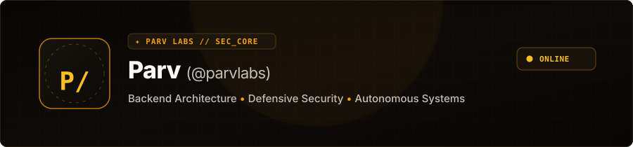

  <picture>
    <source media="(prefers-color-scheme: dark)" srcset="assets/hero-dark.svg">
    <source media="(prefers-color-scheme: light)" srcset="assets/hero-light.svg">
    
  </picture>

 

<table>
  <tr>
    <td width="130" align="center" valign="middle" bgcolor="#0d0b08" style="border: 1px solid #382d1c; border-radius: 8px 0 0 8px;">
      
    </td>
    <td valign="middle" bgcolor="#0d0b08" style="border: 1px solid #382d1c; border-radius: 0 8px 8px 0; padding: 16px;">
      <h3 style="color: #fbbf24; margin: 0 0 6px 0;">✦ Identity &amp; Engineering Mission</h3>
      

        Developer and security practitioner based in India specializing in <strong style="color: #fbfaf8;">backend infrastructure, offensive/defensive tooling, and autonomous agent systems</strong>. Focused on zero-trust application design, resilient server architecture, and applied penetration testing.
      

    </td>
  </tr>
</table>

---

### ⚡ Featured Systems & Engineering Projects

<table>
  <tr>
    <td width="100%" bgcolor="#0d0b08" style="border: 1px solid #382d1c; border-radius: 8px; padding: 18px;">
      <h3 style="color: #fbbf24; margin-top: 0;">◈ PARV v5.0 — Autonomous 3D Holographic AI Assistant</h3>
      
Autonomous desktop AI assistant and cyber visualizer with mid-air gesture control, multi-LLM cascade routing, computer-use automation, and a zero-trust execution sandbox.

      

        <code>Python 3.11</code> • <code>PyQt6 / QML</code> • <code>Three.js (WebGL)</code> • <code>Google Gemini / DeepSeek / OpenAI</code> • <code>MediaPipe / OpenCV</code> • <code>Faster-Whisper</code> • <code>Edge-TTS</code> • <code>SQLite</code>
      

      

         &nbsp;•&nbsp; 
        <em style="color: #c5beb4;">Proprietary core &amp; architecture</em>
      

      

        
<strong style="color: #f59e0b; cursor: pointer;">System Architecture &amp; Key Highlights ▾</strong>

         
        <ul style="color: #c5beb4;">
          <li><strong style="color: #fbfaf8;">3D Holographic HUD:</strong> Audio-reactive visualizer and 3D disc interface rendered via Three.js WebGL inside PyQt6.</li>
          <li><strong style="color: #fbfaf8;">Computer Vision Control:</strong> Real-time MediaPipe/OpenCV gesture tracking (pinch zoom, swipe rotate, open-palm wake).</li>
          <li><strong style="color: #fbfaf8;">Voice Pipeline:</strong> Multilingual synthesis via <code>hi-IN-MadhurNeural</code> (Hinglish/English), clap-to-wake trigger, and Faster-Whisper local STT.</li>
          <li><strong style="color: #fbfaf8;">Resilient AI Cascade:</strong> Multi-provider fallback (Gemini, DeepSeek, OpenAI) with automatic HTTP 429 quota failover.</li>
          <li><strong style="color: #fbfaf8;">Computer-Use Automation:</strong> PyAutoGUI agent orchestrator for hands-free OS workflow automation.</li>
          <li><strong style="color: #fbfaf8;">Cyber War-Room Visualizer:</strong> Interactive network scanning radar and real-time endpoint diagnostic visualizer.</li>
          <li><strong style="color: #fbfaf8;">4-Tier Memory System:</strong> Long-term context persistence and document retrieval using SQLite-backed RAG.</li>
          <li><strong style="color: #fbfaf8;">5-Layer Zero-Trust Hardening:</strong> Prompt-injection defense, file sandboxing, and runtime credential redaction.</li>
        </ul>
      

    </td>
  </tr>
</table>

 

<table>
  <tr>
    <td width="100%" bgcolor="#0d0b08" style="border: 1px solid #382d1c; border-radius: 8px; padding: 18px;">
      <h3 style="color: #fbbf24; margin-top: 0;">◈ CyberPath — AI Cybersecurity Assessment &amp; Mentorship Ecosystem (SIH26101)</h3>
      
Diagnostic cybersecurity education platform featuring competency mapping, generative AI threat simulations, and dynamic career track alignment built as an ultra-fast Vanilla JS SPA.

      

        <code>JavaScript (ES6+)</code> • <code>HTML5 Canvas / SVG</code> • <code>Modern CSS3</code> • <code>Google Gemini API</code> • <code>Firebase Auth &amp; Firestore</code>
      

      

         &nbsp;|&nbsp; 
        
      

      

        
<strong style="color: #f59e0b; cursor: pointer;">System Architecture &amp; Key Highlights ▾</strong>

         
        <ul style="color: #c5beb4;">
          <li><strong style="color: #fbfaf8;">Cyber DNA Radar:</strong> Evaluates 48 granular proficiencies across 8 core security domains on native HTML5 Canvas.</li>
          <li><strong style="color: #fbfaf8;">Role Gap Engine:</strong> Benchmark algorithm matching developer competencies against 9 cybersecurity career tracks.</li>
          <li><strong style="color: #fbfaf8;">Adaptive AI Assessments:</strong> Generative Gemini-driven MCQs with streak-based dynamic difficulty scaling.</li>
          <li><strong style="color: #fbfaf8;">AI Career Mentor:</strong> Context-aware advisory system backed by a 5-model cascade failover for 99.9% uptime.</li>
          <li><strong style="color: #fbfaf8;">Zero-Dependency SPA:</strong> 18 modular controllers, native SVG visualizations, and strict client-side data isolation.</li>
          <li><strong style="color: #fbfaf8;">Offline-First Architecture:</strong> Full local storage functionality with optional Firestore cloud synchronization.</li>
        </ul>
      

    </td>
  </tr>
</table>

 

<table>
  <tr>
    <td width="100%" bgcolor="#0d0b08" style="border: 1px solid #382d1c; border-radius: 8px; padding: 18px;">
      <h3 style="color: #fbbf24; margin-top: 0;">◈ Mobile Self-Hosted Server</h3>
      
Lightweight self-hosted infrastructure turning an Android device into a private, remotely accessible personal server, telemetry monitor, and encrypted file-sharing hub.

      

        <code>Android</code> • <code>Termux</code> • <code>Python</code> • <code>Flask</code> • <code>REST API</code> • <code>Tailscale Mesh VPN</code> • <code>Linux / Bash</code>
      

      

         &nbsp;|&nbsp; 
        
      

      

        
<strong style="color: #f59e0b; cursor: pointer;">System Architecture &amp; Key Highlights ▾</strong>

         
        <ul style="color: #c5beb4;">
          <li><strong style="color: #fbfaf8;">Real-Time Telemetry:</strong> Live dashboard tracking CPU load, RAM utilization, battery temperature, and network throughput.</li>
          <li><strong style="color: #fbfaf8;">Secure Web File Manager:</strong> Browser-accessible file explorer with token-authenticated transfers.</li>
          <li><strong style="color: #fbfaf8;">Hardened Defense:</strong> Path-traversal mitigation, strict input sanitization, and structured security logging.</li>
          <li><strong style="color: #fbfaf8;">Zero-Port-Forwarding:</strong> Mesh VPN routing via Tailscale without exposing public ports.</li>
          <li><strong style="color: #fbfaf8;">Daemon Autostart:</strong> Background health monitoring daemon with automatic restart on process crash.</li>
        </ul>
      

    </td>
  </tr>
</table>

---

### 📂 More Repositories

| Repository | Tech Stack | Engineering Scope |
| :--- | :--- | :--- |
| [**Advance-Student-Management-System**](https://github.com/parvlabs/Advance-Student-Management-System) | `Python` • `SQLite` • `Tkinter` | Transactional CRUD database engine with automated reporting and audit logs |
| [**Portfolio**](https://github.com/parvlabs/portfolio) | `HTML5` • `CSS3` • `JavaScript` | Personal engineering showcase with custom cyber aesthetics and interactive project index |

---

### 🛠️ Technical Stack

  <picture>
    <source media="(prefers-color-scheme: dark)" srcset="https://skillicons.dev/icons?i=python,js,html,css,react,nodejs,bash,linux,git,docker&theme=dark">
    <source media="(prefers-color-scheme: light)" srcset="https://skillicons.dev/icons?i=python,js,html,css,react,nodejs,bash,linux,git,docker&theme=light">
    
  </picture>

---

### 🔭 Current Focus & Research

- 🛡️ **Penetration Testing:** Practical offensive security labs, vulnerability assessments, and network reconnaissance.
- ⚡ **Backend & Scalability:** Low-latency Python/Node.js microservices with zero-trust token authentication.
- 🧠 **Agentic AI Systems:** Autonomous multi-model reasoning cascades and deterministic execution frameworks.

---

### 📊 Telemetry & Contribution Graph

<!-- Activity Line Graph -->

  <picture>
    <source media="(prefers-color-scheme: dark)" srcset="https://github-readme-activity-graph.vercel.app/graph?username=parvlabs&bg_color=070605&color=f59e0b&line=fbbf24&point=fbfaf8&area=true&hide_border=true">
    <source media="(prefers-color-scheme: light)" srcset="https://github-readme-activity-graph.vercel.app/graph?username=parvlabs&bg_color=fbfaf8&color=d97706&line=b45309&point=1c1917&area=true&hide_border=true">
    
  </picture>

 

<!-- Stats & Top Languages Cards -->

  <picture>
    <source media="(prefers-color-scheme: dark)" srcset="https://github-readme-stats.vercel.app/api?username=parvlabs&show_icons=true&theme=dark&bg_color=070605&title_color=fbbf24&text_color=c5beb4&icon_color=f59e0b&border_color=382d1c&hide_border=false&include_all_commits=true">
    <source media="(prefers-color-scheme: light)" srcset="https://github-readme-stats.vercel.app/api?username=parvlabs&show_icons=true&theme=default&bg_color=fbfaf8&title_color=b45309&text_color=57534e&icon_color=d97706&border_color=e3ded5&hide_border=false&include_all_commits=true">
    
  </picture>
  <picture>
    <source media="(prefers-color-scheme: dark)" srcset="https://github-readme-stats.vercel.app/api/top-langs/?username=parvlabs&layout=compact&theme=dark&bg_color=070605&title_color=fbbf24&text_color=c5beb4&border_color=382d1c&hide_border=false">
    <source media="(prefers-color-scheme: light)" srcset="https://github-readme-stats.vercel.app/api/top-langs/?username=parvlabs&layout=compact&theme=default&bg_color=fbfaf8&title_color=b45309&text_color=57534e&border_color=e3ded5&hide_border=false">
    
  </picture>

 

<!-- Contribution Grid Snake Animation -->

  <picture>
    <source media="(prefers-color-scheme: dark)" srcset="https://raw.githubusercontent.com/parvlabs/parvlabs/output/github-contribution-grid-snake-dark.svg">
    <source media="(prefers-color-scheme: light)" srcset="https://raw.githubusercontent.com/parvlabs/parvlabs/output/github-contribution-grid-snake.svg">
    
  </picture>

---

### 📬 Connect & Direct Dispatch

  
  &nbsp;
  
  &nbsp;
  
  &nbsp;
  

