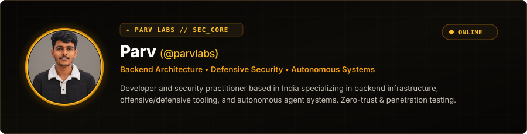
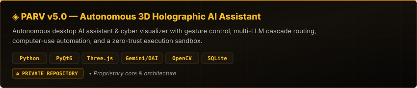
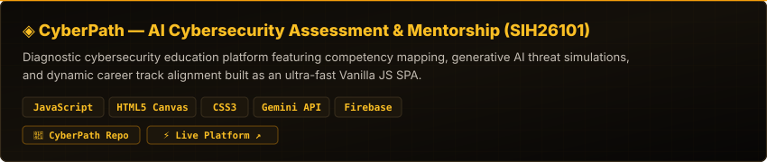
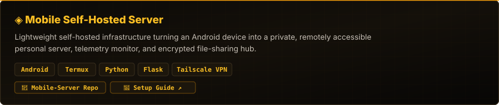
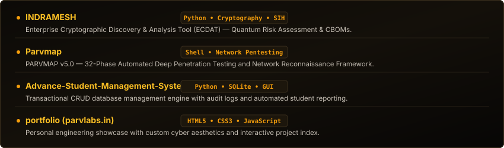
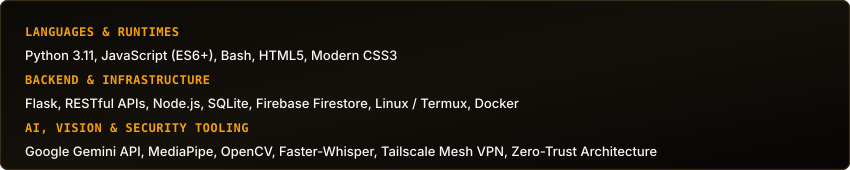
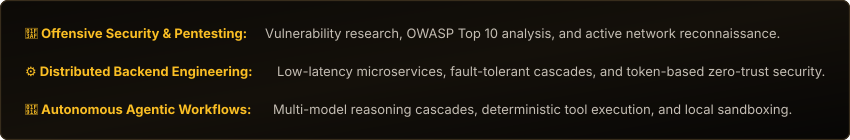
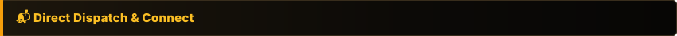

  <picture>
    <source media="(prefers-color-scheme: dark)" srcset="assets/header-card-dark.svg">
    <source media="(prefers-color-scheme: light)" srcset="assets/header-card-light.svg">
    
  </picture>

 

 

<!-- Project 1: PARV v5.0 -->

  
<strong>System Architecture &amp; Key Highlights ▾</strong>

   

* **3D Holographic HUD:** Audio-reactive visualizer and 3D disc interface rendered via Three.js WebGL inside PyQt6.
* **Computer Vision Control:** Real-time MediaPipe/OpenCV gesture tracking (pinch zoom, swipe rotate, open-palm wake).
* **Voice Pipeline:** Multilingual synthesis via `hi-IN-MadhurNeural` (Hinglish/English), clap-to-wake trigger, and Faster-Whisper local STT.
* **Resilient AI Cascade:** Multi-provider fallback (Gemini, DeepSeek, OpenAI) with automatic HTTP 429 quota failover.
* **Computer-Use Automation:** PyAutoGUI agent orchestrator for hands-free OS workflow automation.
* **Cyber War-Room Visualizer:** Interactive network scanning radar and real-time endpoint diagnostic visualizer.
* **4-Tier Memory System:** Long-term context persistence and document retrieval using SQLite-backed RAG.
* **5-Layer Zero-Trust Hardening:** Prompt-injection defense, file sandboxing, and runtime credential redaction.

 

<!-- Project 2: CyberPath -->

  
<strong>System Architecture &amp; Key Highlights ▾</strong>

   

* **Cyber DNA Radar:** Evaluates 48 granular proficiencies across 8 core security domains on native HTML5 Canvas.
* **Role Gap Engine:** Benchmark algorithm matching developer competencies against 9 cybersecurity career tracks.
* **Adaptive AI Assessments:** Generative Gemini-driven MCQs with streak-based dynamic difficulty scaling.
* **AI Career Mentor:** Context-aware advisory system backed by a 5-model cascade failover for 99.9% uptime.
* **Zero-Dependency SPA:** 18 modular controllers, native SVG visualizations, and strict client-side data isolation.
* **Offline-First Architecture:** Full local storage functionality with optional Firestore cloud synchronization.

 

<!-- Project 3: Mobile Server -->

  
<strong>System Architecture &amp; Key Highlights ▾</strong>

   

* **Real-Time Telemetry:** Live dashboard tracking CPU load, RAM utilization, battery temperature, and network throughput.
* **Secure Web File Manager:** Browser-accessible file explorer with token-authenticated transfers.
* **Hardened Defense:** Path-traversal mitigation, strict input sanitization, and structured security logging.
* **Zero-Port-Forwarding:** Mesh VPN routing via Tailscale without exposing public ports.
* **Daemon Autostart:** Background health monitoring daemon with automatic restart on process crash.

 

 
 

 

  <picture>
    <source media="(prefers-color-scheme: dark)" srcset="https://skillicons.dev/icons?i=python,js,html,css,react,nodejs,bash,linux,git,docker&theme=dark">
    <source media="(prefers-color-scheme: light)" srcset="https://skillicons.dev/icons?i=python,js,html,css,react,nodejs,bash,linux,git,docker&theme=light">
    
  </picture>

 

 
 

<!-- Activity Line Graph -->

  <picture>
    <source media="(prefers-color-scheme: dark)" srcset="https://github-readme-activity-graph.vercel.app/graph?username=parvlabs&bg_color=070605&color=f59e0b&line=fbbf24&point=fbfaf8&area=true&hide_border=true">
    <source media="(prefers-color-scheme: light)" srcset="https://github-readme-activity-graph.vercel.app/graph?username=parvlabs&bg_color=fbfaf8&color=d97706&line=b45309&point=1c1917&area=true&hide_border=true">
    
  </picture>

 

<!-- Stats & Top Languages Cards -->

  <picture>
    <source media="(prefers-color-scheme: dark)" srcset="https://github-readme-stats.vercel.app/api?username=parvlabs&show_icons=true&theme=dark&bg_color=070605&title_color=fbbf24&text_color=c5beb4&icon_color=f59e0b&border_color=382d1c&hide_border=false&include_all_commits=true">
    <source media="(prefers-color-scheme: light)" srcset="https://github-readme-stats.vercel.app/api?username=parvlabs&show_icons=true&theme=default&bg_color=fbfaf8&title_color=b45309&text_color=57534e&icon_color=d97706&border_color=e3ded5&hide_border=false&include_all_commits=true">
    
  </picture>
  <picture>
    <source media="(prefers-color-scheme: dark)" srcset="https://github-readme-stats.vercel.app/api/top-langs/?username=parvlabs&layout=compact&theme=dark&bg_color=070605&title_color=fbbf24&text_color=c5beb4&border_color=382d1c&hide_border=false">
    <source media="(prefers-color-scheme: light)" srcset="https://github-readme-stats.vercel.app/api/top-langs/?username=parvlabs&layout=compact&theme=default&bg_color=fbfaf8&title_color=b45309&text_color=57534e&border_color=e3ded5&hide_border=false">
    
  </picture>

 

<!-- Contribution Grid Snake Animation -->

  <picture>
    <source media="(prefers-color-scheme: dark)" srcset="https://raw.githubusercontent.com/parvlabs/parvlabs/output/github-contribution-grid-snake-dark.svg">
    <source media="(prefers-color-scheme: light)" srcset="https://raw.githubusercontent.com/parvlabs/parvlabs/output/github-contribution-grid-snake.svg">
    
  </picture>

 

  
  &nbsp;
  
  &nbsp;
  
  &nbsp;
  

